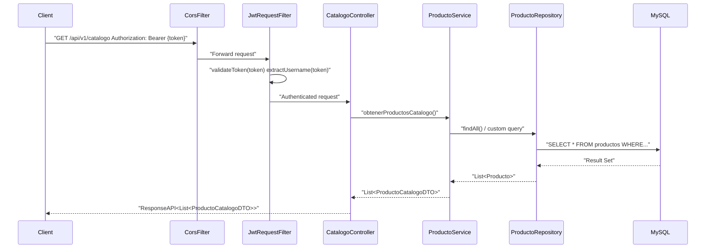
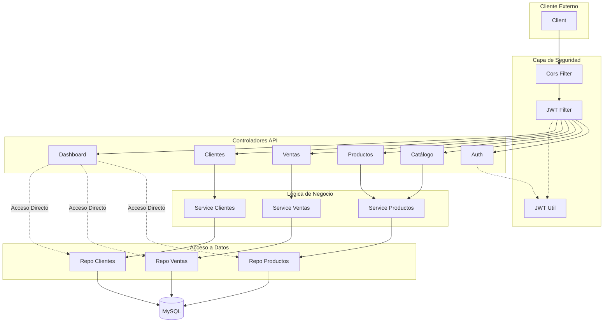

# Descripción del Proyecto
Este repositorio contiene el código fuente de un sistema de gestión de recursos (ERP). El sistema implementa lógica de negocio para el control de stock, facturación y seguridad.

## Funcionalidad Destacada: Integración Web
El sistema permite la conexión con plataformas externas (como una tienda online).
* **Sincronización en Tiempo Real:** Los cambios de precio o stock impactan inmediatamente en cualquier frontend conectado.
* **Control de Visibilidad:** Permite gestionar qué productos se publican en la web y cuáles quedan reservados solo para venta interna.

## Qué puede hacer el sistema

### Gestión de Inventario
* Control de altas, bajas y modificaciones de productos.
* Monitoreo de niveles de stock para prevenir faltantes.
* Cálculo de costos y precios de venta.

### Ventas y Facturación
* Registro transaccional de ventas con múltiples productos.
* **Generación de PDFs:** El sistema crea automáticamente comprobantes de venta utilizando **JasperReports**, listos para entregar al cliente.
* Cálculo automático de márgenes de ganancia por operación.

### Métricas
* Panel de control para visualizar el estado del negocio.
* Reportes de ingresos diarios y mensuales.
* Identificación rápida de productos con mayor rotación.

## Stack Tecnológico
* **Lenguaje:** Java 17
* **Framework:** Spring Boot 3 (Web, Data JPA, Security)
* **Base de Datos:** MySQL
* **Seguridad:** Implementación de JWT 
* **Reportes:** JasperReports
* **Despliegue:** Soporte para Docker

